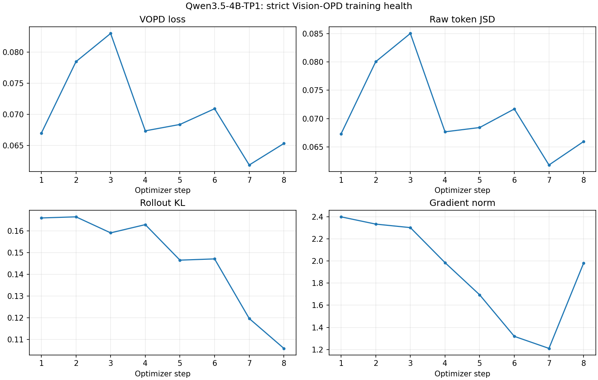

# Qwen3.5-4B-TP1 Early Training Health

**Verdict: WARN** at optimizer step **8**.

> This is an early failure detector, not a substitute for the official six-benchmark alignment gate. The Vision-OPD paper reports objective/regularization ablations and final benchmark scores, but no per-step training-loss, KL, or gradient-norm reference curve.

Reference window: steps `1-5`; recent window: steps `4-8`.

| Check | Status | Reference | Recent | Detail |
| --- | --- | ---: | ---: | --- |
| teacher/bbox/fallback/EMA invariants | PASS | n/a | n/a | all steps valid |
| VOPD loss trend | WARN | 0.072843 | 0.066789 | recent/reference=0.917 |
| raw JSD trend | WARN | 0.073687 | 0.067113 | recent/reference=0.911 |
| rollout KL trend | PASS | 0.160145 | 0.136366 | recent/reference=0.852 |
| gradient stability | PASS | n/a | n/a | recent range=1.210290-1.985077 |
| rollout/training PPL alignment | WARN | n/a | n/a | recent max |ratio-1|=0.169, max |log-PPL diff|=0.206 |
| response truncation | PASS | n/a | n/a | recent mean=0.91% |

## Latest Scalars

| Metric | Value |
| --- | ---: |
| `actor/vopd_loss` | 0.065351 |
| `self_distillation/raw_jsd_token_mean` | 0.065958 |
| `actor/grad_norm` | 1.980447 |
| `rollout_corr/kl` | 0.105843 |
| `rollout_corr/training_ppl` | 2.900971 |
| `rollout_corr/rollout_ppl` | 2.181228 |
| `rollout_corr/ppl_ratio` | 1.150936 |
| `rollout_corr/log_ppl_abs_diff` | 0.142736 |
| `response_length/clip_ratio` | 0.002604 |
| `self_distillation/num_distill_tokens` | 173.095749 |
