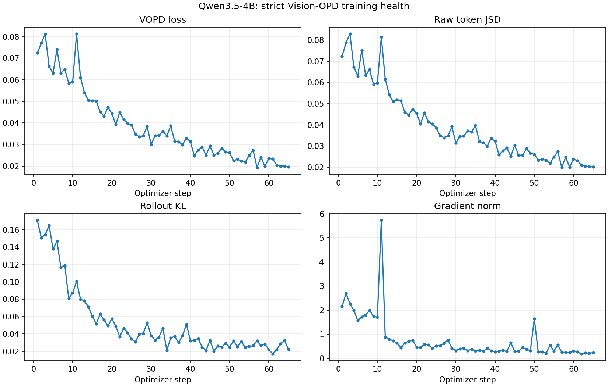

# Qwen3.5-4B Early Training Health

**Verdict: WARN** at optimizer step **65**.

> This is an early failure detector, not a substitute for the official six-benchmark alignment gate. The Vision-OPD paper reports objective/regularization ablations and final benchmark scores, but no per-step training-loss, KL, or gradient-norm reference curve.

Reference window: steps `11-15`; recent window: steps `61-65`.

| Check | Status | Reference | Recent | Detail |
| --- | --- | ---: | ---: | --- |
| teacher/bbox/fallback/EMA invariants | PASS | n/a | n/a | all steps valid |
| VOPD loss trend | PASS | 0.059422 | 0.020636 | recent/reference=0.347 |
| raw JSD trend | PASS | 0.060042 | 0.021050 | recent/reference=0.351 |
| rollout KL trend | PASS | 0.078143 | 0.024466 | recent/reference=0.313 |
| gradient stability | PASS | n/a | n/a | recent range=0.186727-0.271146 |
| rollout/training PPL alignment | WARN | n/a | n/a | recent max |ratio-1|=0.097, max |log-PPL diff|=0.070 |
| response truncation | PASS | n/a | n/a | recent mean=2.27% |

## Latest Scalars

| Metric | Value |
| --- | ---: |
| `actor/vopd_loss` | 0.019506 |
| `self_distillation/raw_jsd_token_mean` | 0.020212 |
| `actor/grad_norm` | 0.235118 |
| `rollout_corr/kl` | 0.022391 |
| `rollout_corr/training_ppl` | 4.617635 |
| `rollout_corr/rollout_ppl` | 4.470832 |
| `rollout_corr/ppl_ratio` | 1.018133 |
| `rollout_corr/log_ppl_abs_diff` | 0.065719 |
| `response_length/clip_ratio` | 0.020833 |
| `self_distillation/num_distill_tokens` | 223.251724 |
